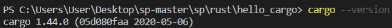
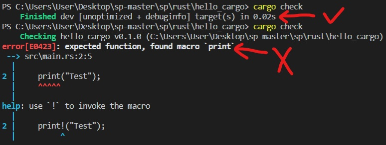
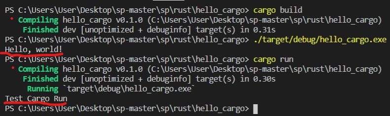
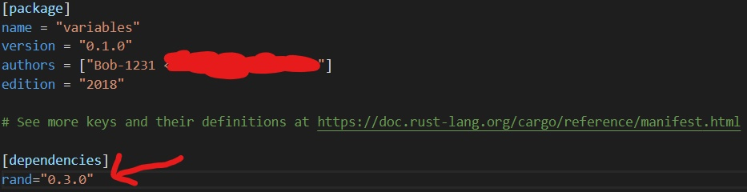
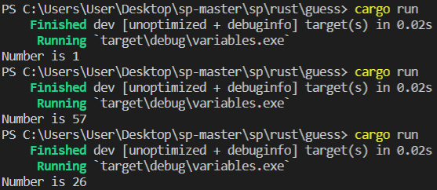
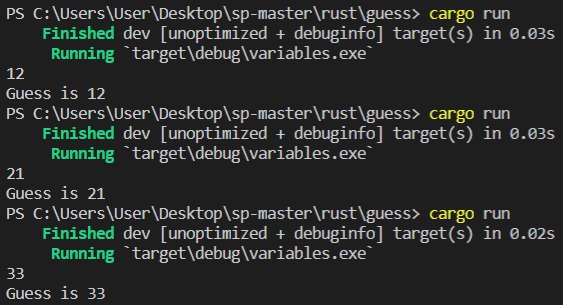
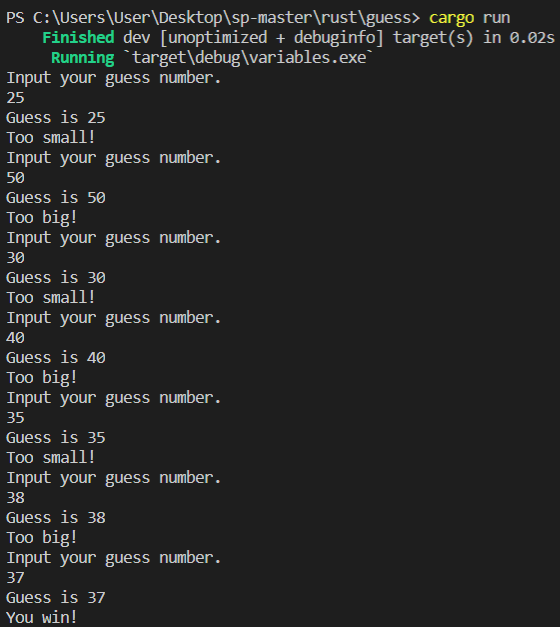

# Rust程式語言
參考主要來源為：   
> - <a href="https://kaisery.gitbooks.io/trpl-zh-cn/content/">Rust程序設計語言（第二版& 2018 edition）</a>
> - <a href="https://askeing.github.io/rust-book/README.html">Rust程式語言 正體中文版</a>
## 前言
在開始使用之前，我先在<a href="https://kaisery.gitbooks.io/trpl-zh-cn/content/ch01-01-installation.html">這裡</a>按照教學安裝好Rust，安裝過程到開始編譯是沒遇到問題，如果有安裝好卻無法編譯，可以參考<a href="https://github.com/JesusDick/sp108b/blob/master/%E6%9C%9F%E6%9C%AB%E5%A0%B1%E5%91%8A/FinalTest.md">這篇的前置作業</a>，或許能解決。
## 簡介
Rust是由Mozilla主導開發的通用、編譯型程式語言。設計準則為「安全、並行、實用」，支援函數式、並行式、程序式以及物件導向的編程風格。--<a href="https://zh.wikipedia.org/wiki/Rust">Rust維基百科</a>   
## 試試Hello World
每次學習新程式，第一步永遠要先學會執行Hello World，執行之前先創建一個放置Rust代碼的資料夾，在PowerShell裡面輸入
<pre>
mkdir project       //創建名叫project的資料夾
cd project          //切換到project資料夾
mkdir hello_world   //在project資料夾裡面創建hello_world資料夾
cd hello_world      //切換到hello_world資料夾
</pre>
再來新增源文件，Rust源文件的副檔名必須以 **.rs** 為結尾。再來看看程式碼：
<pre>
fn main() {
    println!("Hello World");
}
</pre>
第一次看到這段程式的時候其實有些不習慣，因為沒看過fn main，只有看過int main或是def main等，不過fn應該是function的意思。還有println!指令，上網查了才知道print+ln意思是執行完換行的意思，沒換行就是只有print。至於！的部分，
>println!調用了一個Rust宏（macro）。如果是調用函數，則應輸入println（沒有!）。當看到符號!的時候，就意味著調用的是宏而不是普通函數。

文中只有先簡述了一下！的意思，要到後面章節才會詳細介紹，所以現在也還不太懂。
### 編譯和執行
從文中介紹看起來可以用rustc或是cargo進行編譯和執行，以下嘗試對這兩者做比較。如果安裝Rust時是用官方安裝包，則也自帶了Cargo，檢查有沒有Cargo可以在PowerShell輸入 "**cargo --version**"，如果看到版本號，代表有Cargo。   

不過要使用cargo，也要先創建一個cargo的目錄，回到存放代碼的目錄(project)，執行：
<pre>
cargo new hello_cargo       //創建名叫hello_cargo的資料夾
cd hello_cargo              //切換到hello_cargo資料夾
</pre>
執行完會產生其中一個文件叫*Cargo.toml*，裡面內容簡單來說好像是Cargo編譯程式所需的配置，所以去測試了沒有該文件的地方執行Cargo，發現沒有它就無法使用Cargo指令。
#### 編譯
>rustc 源檔名   
cargo build

兩者都是編譯完建立可執行檔。rustc會把執行檔就放在原資料夾裡面；Cargo是把執行檔放在/target/debug/hello_cargo.exe
#### 執行
>./源檔名.exe   
./target/debug/hello_cargo.exe

rustc因為沒變更資料夾，所以直接./執行；Cargo因為特別放在其它資料夾，所以還要輸入路徑。   
rustc的編譯和執行從文中看起來就這樣了，但Cargo還有其它指令是需要知道的。

---
### Cargo
**cargo check** 指令可以在打完一段程式後，隨時檢查代碼是否可以編譯，如果程式沒問題的話就會印出Finished，有錯誤就會印出error並會提示錯誤在哪。這個指令就是單純檢查錯誤，不會產生執行檔，所以應該也節省了一點空間。   

**cargo run** 指令可以在打完程式後，編譯完馬上執行，可以省去cargo build還有./target/debug/hello_cargo.exe的時間，而且這指令也會跟cargo check一樣，有錯誤會顯示出來，應該可以說是涵蓋檢查、編譯、執行的動作。如果程式有更動，這指令也會自動重新編譯出一個執行檔，且Cargo只重新編譯有做修改的部份，可以增加編譯速度。   

---
## Guess Number
接下來是嘗試跟著文中範例做程式碼練習。
### 產生亂數
***
先產生要猜的數字，猜數字當然不是自己出數字自己猜，而是要系統變出亂數自己猜，因此需要引入套件，而官方有提供 **rand** 套件來產生隨機數值，要加入rand套件要先回到 *Cargo.toml* 中，接著在[dependencies]底下加入 **rand = "0.3.0"**

而版本號根據文中也有其它表示方式代表不同意思：
>上面的版號實際上可以寫成 ^0.3.0，代表「所有跟 0.3.0 相容的版本」。 如果我們想要確實的使用 0.3.0，我們可以寫成 rand="=0.3.0"（請注意兩個等號）。 而當我們想要使用最新版，我們可以使用 *。 

現在就可以把套件加入程式碼了，因為Rust對於套件有定義了一個新的名稱 **crate(板條箱)**，若要在程式碼中使用套件，需在程式碼的最上方使用 **extern crate** 指令。
<pre>
extern crate rand;
</pre>
接下來要產生隨機變數，先設定一個變數名稱，然後把要隨機產生的數字指定給它
<pre>
fn main() {
    let answer = rand::thread_rng().gen_range(1, 101);
}
</pre>
***
雖然看起來跟任何程式語言一樣，但文中有提到Rust程式語言的變數綁定還暗藏玄機：
> <pre>let foo = bar</pre>舉例來說，它預設是 不可變的（immutable）。 這也是為何我們的範例使用 mut：它使綁定變成可變的（mutable），而不再是不可變的。 let 不會從左邊取得賦值（assignment）的名字，實際上他使用「模式」（pattern）。 我們在後面會使用模式。 對於我們的簡單情況，它已經夠用了：
> <pre>let foo = 5;       // immutable.
> let mut bar = 5;   // mutable</pre>
這意思應該是說變數foo沒有使用mut，所以不能進行修改；而變數bar有使用mut，所以程式在執行的時候可以被改成其它值。   
***
現在來看看這段程式碼
<pre>
let answer = rand::thread_rng().gen_range(1, 101);
</pre>
變數 answer 是用來儲存要猜的那個數字，答案是不需要被更動的，所以不需要加上mut。   
<pre>
rand::thread_rng()
</pre>
文中講到「可以透過 **rand::** 前綴詞來使用任何 rand crate 內的東西。」所以 :: 應該就是說從前者的套件來使用後者的項目，也就是從 rand套件裡面使用thread_rng()的東西。上網查了一下 thread_rng()簡單來說是隨機數字產生器：
> Retrieve the lazily-initialized thread-local random number generator, seeded by the system. --<a href="https://docs.rs/rand/0.7.3/rand/fn.thread_rng.html">Function rand::thread_rng</a>

接下來看這個
<pre>
.gen_range(1, 101);
</pre>
看上去第一個想到的是generate range 1~101，從1到101之間產生數字。但文中提到：
>結果包含了下限，但不包含上限，所以我們需要傳遞 1 和 101 去取得 1 到 100 範圍內的數字。

所以並不包含101在內。這讓我想到之前學C取亂數的時候，取1到100要使用 1 + ( rand() % 100 ) 要加1才是取1到100，不加1的話是取0到99。   
文中還有提到說：
> 我們即將使用一個方法（method），這個方法需要 Rng 在有效範圍（scope）中才能運作。

意思應該是說，要產生範圍，需要再加入額外的指令才能產生，所以要再加入
<pre>
use rand::Rng;
</pre>
現在產生完範圍亂數了，執行看看能不能正常產出1到100之間的數。
<pre>
extern crate rand;

use rand::Rng;

fn main() {
    let answer = rand::thread_rng().gen_range(1, 101);

    print!("Number is {}", answer);
}
</pre>
執行結果如下：   

執行3次都產出1到100之間的數字，所以應該沒問題。
### 輸入數字
***
接下來要讓使用者輸入要猜的數字了，因此需要使用輸入輸出的功能，Rust裡面 **std::io** 這個模組提供了輸入與輸出的功能，從名字上來看也是非常直白，大概是 input 跟 output。所以先把程式碼放入
<pre>
use std::io;
</pre>
再來要宣告一個變數，用來儲存使用者輸入的數字
<pre>
let mut guess = String::new();
</pre>
用 mut 大概是因為如果猜錯的話就需要再重複輸入一次，就會變更到變數值，所以用 mut 達成可更動變數。至於 String::new()，文中的解釋是這樣子：
>String 是一個字串型別，由標準函式庫提供。 一個 字串 是一個以 UTF-8 編碼的可變長度的文字。   
而 ::new() 語法使用 :: 是因為它是一個特定型別的「關聯函式」（associated function）。 也就是說，它被關聯到 String 本身，而非特定的某個 String 的實體（instance）。 一些語言稱之為「靜態方法」（static method）。   
此函式被稱為 new()，因為它建立一個新的、空的 String。 你可以在其他許多型別找到 new() 函式，因為它是建立某一些型別新值的通用名稱。

其實看得有點模模糊糊，我自己理解為讓 String 變空，使用者輸入東西到 String 裡面，再指定給 guess 變數。   
目前的程式碼如下：
<pre>
extern crate rand;

use rand::Rng;
use std::io;

fn main() {
    let answer = rand::thread_rng().gen_range(1, 101);

    /*print!("Number is {}", answer);*/

    let mut guess = String::new();
}
</pre>
### 取得數字
***
輸入完數字後要讓系統偵測輸入內容，所以還需要再輸入取得數字的程式碼。(覺得有點不方便，因為C只要輸入 scanf_s("%d", &guess) 就可以輸入並取得數字了)。輸入以下程式碼：
<pre>
io::stdin().read_line(&mut guess)
    .expect("Failed to read line");
</pre>
繼續慢慢看每段程式碼
<pre>
io::stdin()
</pre>
我自己理解為從 io 套件的 standard input 函式執行後面的指令。
<pre>
.read_line(&mut guess)
</pre>
乍看之下應該就是取得數字的地方了，read_line 為取得的動作、(&mut guess) 為目標對象。   
而文中對於這兩段的解釋是：
> io::stdin()：   
這個特殊的函式會回傳一個終端機標準輸入的控制代碼（handle）。   
.read_line(&mut guess)：   
此處，我們呼叫控制代碼（handle）的 read_line() 方法。 方法（method）跟關聯函式很類似，但只能在特定型別的實體（instance）中取用，而不是從型別本身取用。 我們也會傳遞一個參數給 read_line()：&mut guess。   
還記得前面我們如何綁定 guess 嗎？ 我們有提到它是可變的。 然而，read_line 不接受把 String 當作參數：它只接受 &mut String。 Rust 有一個叫做 參照（references）的功能，它允許你將多個參照指向同一塊資料，這樣可以降低複製的動作。 參照是個複雜的功能，Rust 的主要賣點就是能安全、簡單的使用參照。 現在我們不需要知道太多細節。 我們只需知道參照與 let 綁定類似，它預設是不可變的。 因此，我們必須寫成 &mut guess 而不是 &guess。

後半段看起來也有點模糊，但應該是在說 read_line 的參數值要加 mut 才能接受。
<pre>
.expect("Failed to read line");
</pre>
這段我第一想法是 if...else 的感覺，如果 guess 的值是 read_line 無法讀取的值，就印出 Failed to read line。只是 expect 這指令不知道是甚麼意思。文中解釋道：
> io::Result的實例擁有expect方法。如果io::Result實例的值是Err，expect會導致程序崩潰，並顯示當做參數傳遞給expect的信息。如果read_line方法返回Err，則可能是來源於底層操作系統錯誤的結果。如果io::Result實例的值是Ok，expect會獲取Ok中的值並原樣返回。

意思應該是說，read_line 讀取結束後會傳一個參數給 Result，Result 要嘛是 Ok 要嘛是 Err，而 expect() 這個函式可以讀取該參數，如果讀取到 OK 就傳送原本的值回去；如果讀取到 Err 則輸出錯誤訊息。   
現在完成取得輸入的數字程式碼了，來測試輸入完會不會取得該數字
<pre>
extern crate rand;

/*use rand::Rng;*/
use std::io;

fn main() {
    /*let answer = rand::thread_rng().gen_range(1, 101);*/

    /*print!("Number is {}", answer);*/

    let mut guess = String::new();

    io::stdin().read_line(&mut guess)
    .expect("Failed to read line");

    print!("Guess is {}", guess);
}
</pre>
執行結果如下：   

執行了三次都正常，應該沒問題。
### 類型轉換
***
雖然可以正常輸入並取得數字，但在 Rust程式語言中，寫在程式碼的整數預設是32位元類別，也就是在 answer 變數裡面的數字類型是32位元。因此要把 guess 變數裡面的值也轉換成32位元才能比較。新增以下程式碼：
<pre>
let guess: u32 = guess.trim().parse()
    .expect("Please type a number!");
</pre>
這裡又多新增的一個 guess 變數，根據文中寫到，Rust 允許用新的 guess 去「遮蔽」(shadow) 前一個。一開始的是 String，後來 guess: u32 則改成32位元無號整數。而這邊的 guess 一樣存著原本舊 guess 的輸入值。
<pre>
guess.trim().parse()
</pre>
這段是完全看不懂也想不到，文中解釋：
> String 中的 trim() 方法則會去除任何字串開頭結尾的空白。 這很重要，因為我們必須按下「Return」按鍵去符合 read_line() 的輸入條件。 也就是說如果我們輸入 5 然後按下 Return，那 guess 就會是：5\n。 \n 代表「新的一行」（newline）、enter 鍵。 trim() 會去除這些東西，只留下我們要的字串 5。 而 字串的 parse() 方法 則會把字串分析為數字。 因為它可以被分析為很多種數字型別，我們必須給 Rust 我們確切想要的數字型別的提示。 

也就是說，trim() 可以去除多餘的其它東西，只留下原本輸入的字串；而 parse() 可以把字串轉換成數字的意思吧。   
最後的 expect 功能則跟原本一樣。所以現在程式碼為：
<pre>
extern crate rand;

/*use rand::Rng;*/
use std::io;

fn main() {
    /*let answer = rand::thread_rng().gen_range(1, 101);*/

    /*print!("Number is {}", answer);*/

    let mut guess = String::new();

    io::stdin().read_line(&mut guess)
    .expect("Failed to read line");

    let guess: u32 = guess.trim().parse()
    .expect("Please type a number!");

    print!("Guess is {}", guess);
}
</pre>
### 比較猜測值
***
轉換完 guess 的輸入值之後，就可以跟 answer 正確答案做比較了。現在就是要來判斷輸入的值跟答案。輸入程式碼：
<pre>
use std::cmp::Ordering;

match guess.cmp(&answer) {
    Ordering::Less    => println!("Too small!"),
    Ordering::Greater => println!("Too big!"),
    Ordering::Equal   => println!("You win!"),
}
</pre>
這段原本應該是長這樣
<pre>
match guess.cmp(&answer) {
    std::cmp::Ordering::Less    => println!("Too small!"),
    std::cmp::Ordering::Greater => println!("Too big!"),
    std::cmp::Ordering::Equal   => println!("You win!"),
}
</pre>
但因為太長了又不好打，剛好又有套件可以引用，所以把其中 std::cmp::去掉，並引用 std::cmp::Ordering; 項目。   
而 match 有配對的意思，所以這段看起來是用 guess 匹配 answer 的值。如果太小 (Less) 就印出 Too small；太大 (Greater)就印出 Too big；等於 (Equal) 就印出 You win。但 .cmp 跟 Ordering 想不到含意，文中解釋：
> cmp() 方法可以被任何能用來比較的東西呼叫，且它會要求傳入你想比較的東西的參照。 它回傳我們前面 use 的 Ordering 型別。 我們使用 match 陳述去判定它實際上是哪種 Ordering。 Ordering 是個 enum，是枚舉（enumeration）的簡寫，枚舉看起來會有點像這樣：   
enum Foo {   
    Bar,   
    Baz,   
}   
這裡定義了任何一個 Foo，要不是 Foo::Bar，就會是 Foo::Baz。 我們使用 :: 來表示特定 enum 變體的命名空間（namespace）。
Ordering enum 有三個可能的變體：Less、Equal、及 Greater。 match 陳述式取得型別的值，讓你能為每個可能的值建立一條執行的分支。

所以 guess.cmp(&answer) 意思應該是說，呼叫 answer 的值傳給 Ordering 用來比較，而 Ordering 裡面又有不同分支：大於小於等於的分支，再用 match 來進行三種比較。   
目前程式碼為：
<pre>
extern crate rand;

/*use rand::Rng;*/
use std::io;
use std::cmp::Ordering;

fn main() {
    /*let answer = rand::thread_rng().gen_range(1, 101);*/

    /*print!("Number is {}", answer);*/

    let mut guess = String::new();

    io::stdin().read_line(&mut guess)
    .expect("Failed to read line");

    let guess: u32 = guess.trim().parse()
    .expect("Please type a number!");

    print!("Guess is {}", guess);

    match guess.cmp(&answer) {
        Ordering::Less => println!("Too small!"),
        Ordering::Greater => println!("Too big!"),
        Ordering::Equal => println!("You win!")
    }
}
</pre>
### 迴圈
***
因為輸入一次的時候就會結束程式了，所以必須加入迴圈，讓使用者可以一直輸入到正確為止，正確的時候也要跳出停止程式。   
在輸入數字的指令上面加上迴圈指令：
<pre>
    loop {
        let mut guess = String::new();

        io::stdin().read_line(&mut guess)
        .expect("Failed to read line");

        let guess: u32 = guess.trim().parse()
        .expect("Please type a number!");

        print!("Guess is {}", guess);

        match guess.cmp(&answer) {
            Ordering::Less => println!("Too small!"),
            Ordering::Greater => println!("Too big!"),
            Ordering::Equal => {
                println!("You win!");
                break;
            }
        }
    }
</pre>
還有情況是輸入的時候不是輸入數字，但又不要跳出程式而是忽略掉繼續執行。
<pre>
let guess: u32 = match guess.trim().parse() {
    Ok(num) => num,
    Err(_) => continue,
};
</pre>
這段看起來是將 guess 轉換成數字後進行配對 (match)，如果是數字 (num) 則代表OK，可以進行猜數字；如果不是數字則 Err 繼續迴圈重新輸入數字。而文中解釋：
> 把 expect() 改為 match 陳述的方式，大致上就是如何把「錯誤時當機」改為「實際處理錯誤」的方法。 parse() 回傳的 Result 是個跟 Ordering 類似的 enum，但是這裡的變體跟資料有關：Ok 代表成功，Err 則是錯誤。 它們個別包含更多的資訊：成功的分析出整數，或是一個錯誤型別。 在本例中，當我們 match 到 Ok(num) 時，會把 Ok 內的值設給 num 這個名稱，然後在右邊直接回傳它。 在 Err 的情況，我們不在意發生了什麼錯誤，所以我們使用 _ 沒有取名。 這樣會忽略錯誤，接著 continue 讓我們可以繼續 loop 的下一次疊代（iteration）。
### 結果
***
最後把程式碼整理一下：
<pre>
extern crate rand;

use rand::Rng;
use std::io;
use std::cmp::Ordering;

fn main() {
    let answer = rand::thread_rng().gen_range(1, 101);

    /*print!("Number is {}", answer);*/

    loop {
        println!("Input your guess number.");

        let mut guess = String::new();

        io::stdin().read_line(&mut guess)
        .expect("Failed to read line");

        let guess: u32 = match guess.trim().parse() {
            Ok(num) => num,
            Err(_) => continue,
        };

        println!("Guess is {}", guess);

        match guess.cmp(&answer) {
            Ordering::Less => println!("Too small!"),
            Ordering::Greater => println!("Too big!"),
            Ordering::Equal => {
                println!("You win!");
                break;
            }
        }
    }
}
</pre>
執行結果   

可以正常猜數字了！