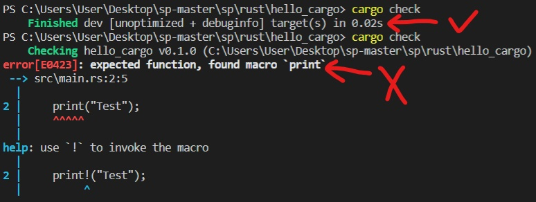
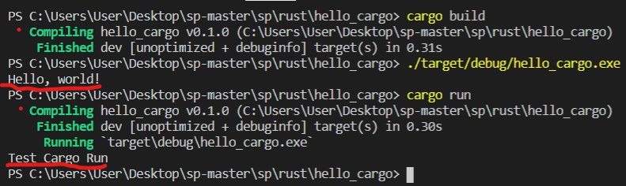

# Rust程式語言
參考主要來源為：<a href="https://kaisery.gitbooks.io/trpl-zh-cn/content/">Rust 程序設計語言（第二版& 2018 edition）</a>
## 簡介
Rust是由Mozilla主導開發的通用、編譯型程式語言。設計準則為「安全、並行、實用」，支援函數式、並行式、程序式以及物件導向的編程風格。--<a href="https://zh.wikipedia.org/wiki/Rust">Rust維基百科</a>   
在開始使用之前，我先在<a href="https://kaisery.gitbooks.io/trpl-zh-cn/content/ch01-01-installation.html">這裡</a>按照教學安裝好Rust，安裝過程到開始編譯是沒遇到問題，如果有安裝好卻無法編譯，可以參考<a href="https://github.com/JesusDick/sp108b/blob/master/%E6%9C%9F%E6%9C%AB%E5%A0%B1%E5%91%8A/EndingTest.md">這篇的前置作業</a>，或許能解決。
## 試試Hello World
每次學習新程式，第一步永遠要先學會執行Hello World，執行之前先創建一個放置Rust代碼的資料夾，在PowerShell裡面輸入
<pre>
mkdir project       //創建名叫project的資料夾
cd project          //切換到project資料夾
mkdir hello_world   //在project資料夾裡面創建hello_world資料夾
cd hello_world      //切換到hello_world資料夾
</pre>
再來新增源文件，Rust源文件的副檔名必須以 **.rs** 為結尾。再來看看程式碼：
<pre>
fn main() {
    println!("Hello World");
}
</pre>
第一次看到這段程式的時候其實有些不習慣，因為沒看過fn main，只有看過int main或是def main，不過fn應該是function的意思。還有println!指令，上網查了才知道print+ln意思是執行完換行的意思，沒換行就是只有print。至於！的部分，
>println!調用了一個Rust宏（macro）。如果是調用函數，則應輸入println（沒有!）。當看到符號!的時候，就意味著調用的是宏而不是普通函數。

文中只有先簡述了一下！的意思，要到後面章節才會詳細介紹，所以現在也還不太懂。
### 編譯和執行
從文中介紹看起來可以用rustc或是cargo進行編譯和執行，以下嘗試對這兩者做比較。如果安裝Rust時是用官方安裝包，則也自帶了Cargo，檢查有沒有Cargo可以在PowerShell輸入 "**cargo --version**"，如果看到版本號，代表有Cargo。   
   
不過要使用cargo，也要先創建一個cargo的目錄，回到存放代碼的目錄(project)，執行：
<pre>
cargo new hello_cargo       //創建名叫hello_cargo的資料夾
cd hello_cargo              //切換到hello_cargo資料夾
</pre>
執行完會產生其中一個文件叫*Cargo.toml*，裡面內容簡單來說好像是Cargo編譯程式所需的配置，所以去測試了沒有該文件的地方執行Cargo，發現沒有它就無法使用Cargo指令。
#### 編譯
>rustc 源檔名   
cargo build

兩者都是編譯完建立可執行檔。rustc會把執行檔就放在原資料夾裡面；Cargo是把執行檔放在/target/debug/hello_cargo.exe
#### 執行
>./源檔名.exe   
./target/debug/hello_cargo.exe

rustc因為沒變更資料夾，所以直接./執行；Cargo因為特別放在其它資料夾，所以還要輸入路徑。   
rustc的編譯和執行從文中看起來就這樣了，但Cargo還有其它指令我覺得蠻方便的。

---
### Cargo
cargo check指令可以在打完一段程式後，隨時檢查代碼是否可以編譯，如果程式沒問題的話就會印出Finished，有錯誤就會印出error並會提示錯誤在哪。這個指令就是單純檢查錯誤，不會產生執行檔，所以應該也節省了一點空間。   

cargo run指令可以在打完程式後，編譯完馬上執行，可以省去cargo build還有./target/debug/hello_cargo.exe的時間，而且這指令也會跟cargo check一樣，有錯誤會顯示出來，應該可以說是涵蓋檢查、編譯、執行的動作。如果程式有更動，這指令也會自動重新編譯出一個執行檔。   

---